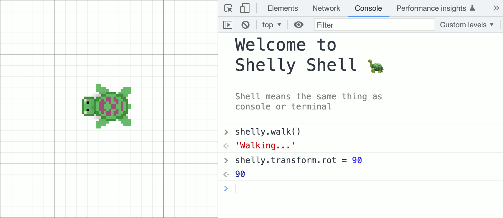

<!-- variables -->
[Svelte.dev]: https://img.shields.io/badge/Svelte-4A4A55?style=for-the-badge&logo=svelte&logoColor=FF3E00
[Svelte-url]: https://svelte.dev/
[NodeJS.org]: https://img.shields.io/badge/Node.js-339933?style=for-the-badge&logo=nodedotjs&logoColor=white
[NodeJS-url]: https://nodejs.org/
[Gimp.org]: https://img.shields.io/badge/gimp-5C5543?style=for-the-badge&logo=gimp&logoColor=white
[Gimp-url]: https://gimp.org/
[YouTube.com]: https://img.shields.io/badge/Shorts-FF0000?style=for-the-badge&logo=youtube&logoColor=white
[TikTok.com]: https://img.shields.io/badge/TikTok-000000?style=for-the-badge&logo=tiktok&logoColor=white
[Discord]: https://img.shields.io/badge/Server-5865F2?style=for-the-badge&logo=discord&logoColor=white

<!-- Social media -->
[YouTube-url]: https://www.youtube.com/
[TikTok-url]: https://www.tiktok.com/
[Discord-url]: https://www.tiktok.com/

<!-- https://github.com/alexandresanlim/Badges4-README.md-Profile/blob/master/README.md#badges -->

<a name="readme-top"></a>

<!-- PROJECT LOGO -->
<br />
<div>
  
  <h1>shelly.run</h1>
  <p>
    Cute browser game that teaches coding fundamentals 
    <br />
    with JavaScript in the browser console.
  </p>
</div>

<!-- PLAY NOW -->
<a href="https://shelly.run" target="_blank">
  
  <!--  -->
</a>

<br />
<br />

<!-- ## Subscribe!
Learn `JavaScript` with Shelly and my **60 second tutorials**

[![JS Shorts][YouTube.com]][YouTube-url]
[![JS Shorts][TikTok.com]][TikTok-url]
[![Discord Server][Discord]][Discord-url] -->

## About The Project
Control shelly via the browser console.
Shelly will react to the functions and variables you invoke or modify.



One of the major technical innovations making shelly.run possible, is the *reactive console bindings*. <br />
Learn more about **reactive browser console** by seing it in action on this [Svelte REPL](https://svelte.dev/repl/e139ee91c1834124a2dcf891c2049b83?version=3.52.0) or get `bindConsole.js` from this [Gist](https://gist.github.com/ferry-creator/625ef854a899653d5acf652b813f784f).

See `bindConsole.js` used in the wild on this repo at `app/src/components/Shelly.svelte`

### Built With

[![Svelte][Svelte.dev]][Svelte-url]
[![NodeJS][NodeJS.org]][NodeJS-url]
[![Gimp][Gimp.org]][Gimp-url]

<br/>

## Getting Started

1. Go to `https://shelly.run`
2. Open **browser console***
3. Run `list()` to browse the interactive documentation

<br/>

***Mac**: <kbd>Cmd</kbd> + <kbd>Option</kbd> + <kbd>J</kbd>
<br/>
***Windows**: <kbd>Ctrl</kbd> + <kbd>Shift</kbd> + <kbd>J</kbd>


<br/>

## Roadmap:
* [x] Reactive browser console (control shelly from console)
* [x] Cute animations 😍🐢
* [x] [Alpha version is online!](https://shelly.run/)
* [ ] **Map screen space to world space**
* [ ] Make `walk()` and `run()` distance parameters work
* [ ] Add `shelly.paint()` for tracing (`canvas API`)
* [ ] Make it ***pretty*** so people can create and post [art](https://startdreambig.org/wp-content/uploads/2019/07/graphic8.png)
* [ ] Add [interactive](https://github.com/rgossiaux/svelte-headlessui) tutorial and difficulties
  * **Intro**: instructions to open console
  * **Noob**: using functions, mutating variables
  * **Turtle master**: turtle graphics! Loops etc.
  * ***HACKER*** 😈: using `list()` and modifying variables directly to do anything.
  Browse server files, change shelly sprites etc. JavaScript is the limit
  <br/>
  ...
* [ ] Add `undo()` to shelly.shell.js, save all prompts in a stack
* [ ] Create a [website](https://kran.ai/ideas/) for everyone to post their art, online gallery
* [ ] Improve `list()`

## Some demo programs to try out
*(Paste these in the browser console on [shelly.run](https://shelly.run/))*

These would be considered difficulty of ***HACKER*** 😅 (hard)
<br />
It's just to show the reactive console 🐢
<br />
<br />

###### Shelly animated:
`shelly.walk()`, `shelly.run()`, `shelly.hide()` and `shelly.stay()`

###### Shelly running:
```javascript
shelly.run()

shelly.transform.rot = -30
setInterval(()=>{
    shelly.transform.pos.y += 1
    shelly.transform.pos.x += 0.3
}, 100)
```

###### Shelly running in circles:
```javascript
shelly.run()

R=20
fx=(t)=>(Math.cos(t)*R) + 50
fy=(t)=>(Math.sin(t)*R) + 50

t = 0
setInterval(()=>{
    shelly.transform.pos.x = fx(t)
    shelly.transform.pos.y = fy(t)
    t += 0.1
    t %= Math.PI*2

    shelly.transform.rot = (360/Math.PI*0.5)*t
}, 100)
```

<br />

## License
Distributed under **MPL-2.0**. See `LICENSE.txt`.
